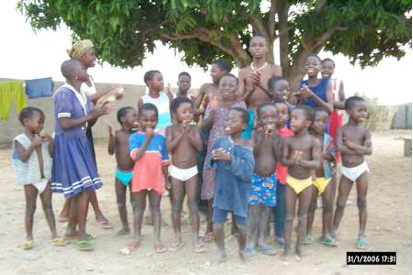

Initialement géré par une ONG (Organisation Non Gouvernementale), l'Organisation pour le Développement par la Promotion de l'Enfance, ou ODPE fondée par des Togolais qui cotisent en fonction de leurs moyens, le foyer a commencé son action, mais l'argent a vite manqué. L’association Enfants-Kara a donc vu le jour en Suisse le 31 octobre 2001 pour compléter le budget de fonctionnement de l'institution.

Depuis 2012, grâce aux efforts de chacun et à vos dons, le foyer est en bonne voie d'évolution et peut bénéficier de l'aide d'autres organismes. Enfants-Kara peut commencer à orienter son aide sur le terrain auprès d' enfants plus âgés, d'une manière plus durable encore, cherchant à favoriser des apprentissages utiles pour eux-mêmes et leur région, afin d'éviter un exode rural massif.

Savoir plus sur Kara :

-   [Kara (Togo)](https://fr.wikipedia.org/wiki/Kara_(Togo))
-   [Kara et sites](http://www.togo-confidentiel.com/texte/Info&Service/Kara_et_sites.htm)
-   [Région de la Kara](https://fr.wikipedia.org/wiki/R%C3%A9gion_de_la_Kara)
