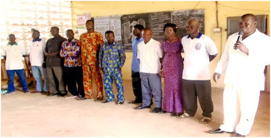

« Mieux vaut apprendre à un jeune enfant à pêcher\
que de lui donner du poisson dans un plat. »
{.text-align-center .font-weight-bold .font-style-italic}

Un enfant de la rue, orphelin, démuni ou victime de la traite est protégé dans le cercle des personnes de bonne volonté qui l'accueillent à bras ouverts pour l'éduquer, le former et lui apprendre à construire son avenir à travers un métier de son choix.

## Structure administrative

Les organes dirigeants de l'institution sont:

- Conseil d'administration
- Bureau exécutif constitué de 5 formateurs ou patrons
- Comité de gestion composé de
  - 5 représentants des apprenants
  - 2 représentants des patrons
  - 1 représentant des éventuels parrains/marraines ou parenté des apprenants

Dirigeants de FE

## But et objectifs

Contribuer à l'épanouissement socio-économique des jeunes issus des familles pauvres par la formation professionnelle gratuite.

Susciter le goût de la formation chez les jeunes en déperdition scolaire et vicitimes de la traite.

Assurer une formation professionnelle aux jeunes des deux sexes.

Favoriser l'accès à la culture générale et au savoir significatif.

## Conditions d'admission

L'institution est ouverte à tous les jeunes orphelins ou démunis des deux sexes sans distinction de religion ou d'ethnie.

Les frais de formation dans toutes les filières sont gratuits.

Un internat est aussi mis gratuitement à la disposition des apprenants dans les filières disponibles.

Depuis sa création en 2005, le Foyer de l'Espérance a déjà formé plus d'une centaine d'orphelins et de victimes de la traite.
