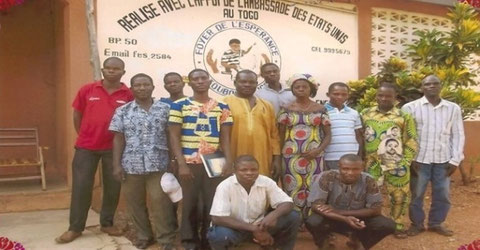
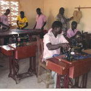
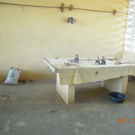
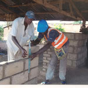
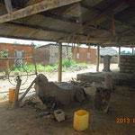
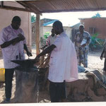
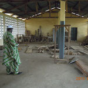
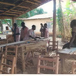

# Le Centre de formation

Les Formateurs

Le Centre de formation du Foyer de l'Espérance fonctionne grâce à l'encadrement bénévole de patrons issus des secteurs suivants :

- Menuiserie
- Maçonnerie
- Mécanique 2 roues
- Electricité bâtiment
- Forge et soudure
- Couture et tissage

&ZeroWidthSpace;

- 
- 
- 
- 
- 
- 
- 

**Cliquez sur une image pour l'agrandir.**

**Tapez Escape pour revenir au format initial.**

## Amélioration des conditions de vie

Il y a une amélioration certaine du cadre de vie de par une formation terminée. Les jeunes peuvent alors se prendre en charge. Ils entretiennent ensuite souvent leurs "petits frères et sœurs", contribuant aussi fréquemment à l'entretien de leur "famille de soutien" après avoir trouvé de l'embauche auprès d'un patron. Des parrainages ou des microcrédits locaux, parfois difficiles à trouver, aident certains à démarrer leur activité d'indépendants.

La couture pose des problèmes spécifiques, les personnes qualifiées ayant de la peine à démarrer leur métier en tant qu'indépendants, car il y peu de patrons engageant des ouvriers(-ères).
