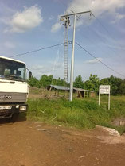
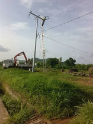

Le début de l'année 2021 a vu l'arrivée du réseau électrique sur le campus du Foyer de l'Espérance. Le raccordement d'abonné a été effectué par la compagnie nationale. Dès lors, Enfants-Kara planche sur les installations intérieures des bâtiments. Le projet est à son début. Beaucoup d'informations doivent être échangées pour être sûrs que les équipements proposés conviennent à tous, en particulier aux ateliers.

- 
- 
