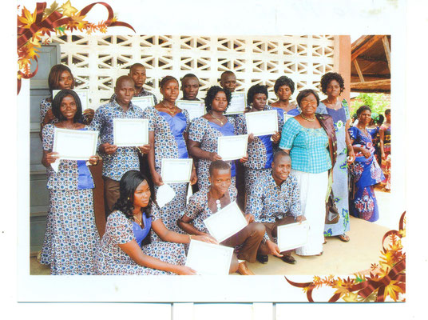

Les kits ont été remis pour la première fois lors de la remise des diplômes de fin de formation au printemps 2015. Ils ont été accueillis avec joie et l'association a été chaleureusement remerciée pour cette initiative.

La répartition entre les différents métiers se présente ainsi :

Couture 9 diplômes

Maçonnerie 3 diplômes

Ferronnerie 2 diplômes

Electricité bâtiment 1 diplôme

- 
- 
- 
- 
