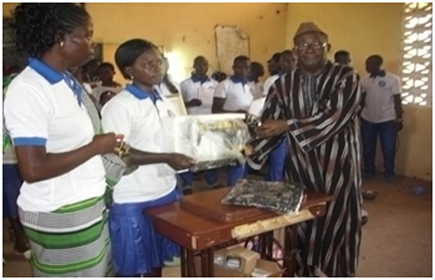
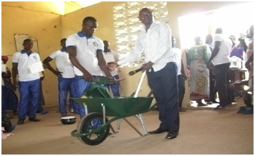
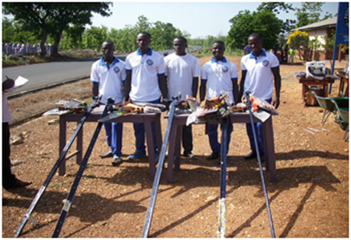
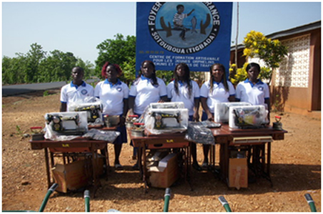
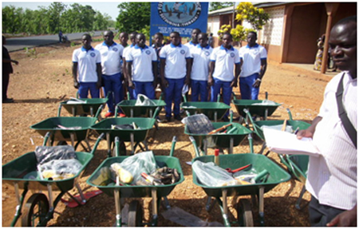
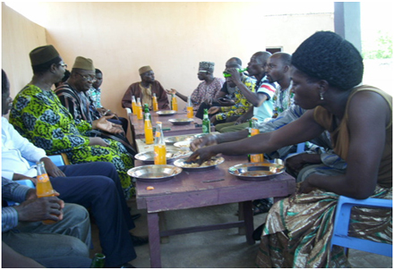

Les kits ont été remis pour la second fois lors de la remise des diplômes de fin de formation au printemps 2016. C'est toujours avec beaucoup de gratitude qu'ils ont été accueillis.

La répartition entre les différents métiers se présente ainsi :

Couture 6 diplômes

Menuiserie 5 diplômes

Maçonnerie 12 diplômes

- 
- 
- 
- 
- 
- 
