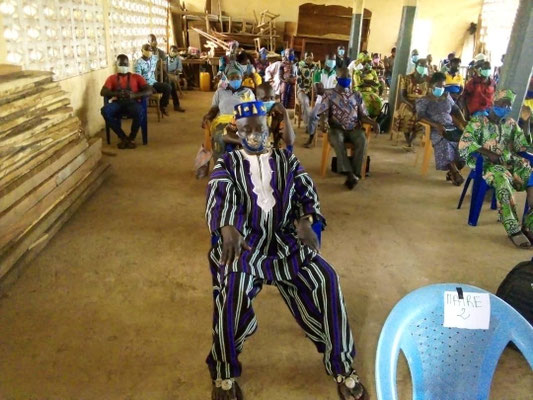
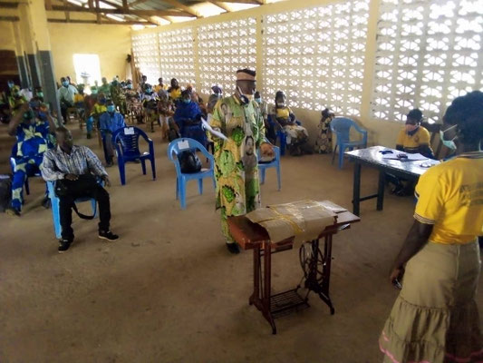
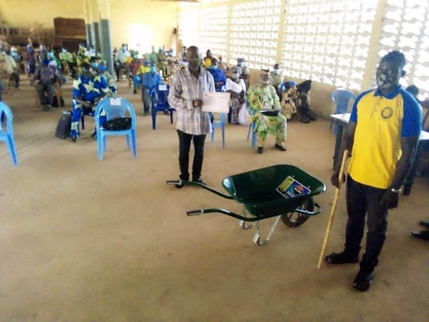
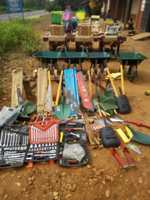
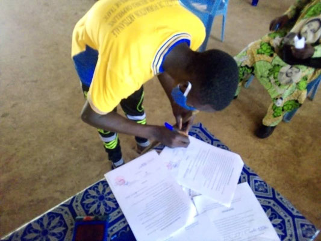
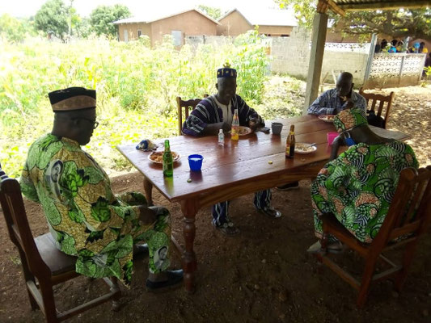
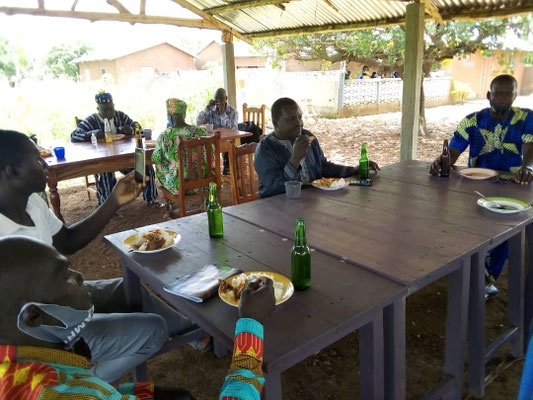

Malgré la menace du COVID19, une brève cérémonie de remise des diplômes et des kits associés a pu être organisées. Toutes les règles sanitaires ont été scrupuleusement appliquées.

- 
- 
- 
- 

De nouveaux contrats d'étudiants ont été signés, démontrant la nécessité des formations.

Un brève collation a réuni les participants en tout esprit de convivialité.

- 
- 
