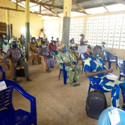
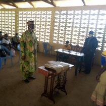
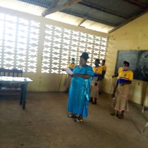

Comme en 2019, la cérémonie de remise des diplômes s'est faite dans le strict respect des mesures sanitaires imposées par la Covid.

C'est à nouveau une vingtaine de nouveaux professionnels qui ont reçus les maintenant habituels kits d'outillage.

- 
- 
- 
