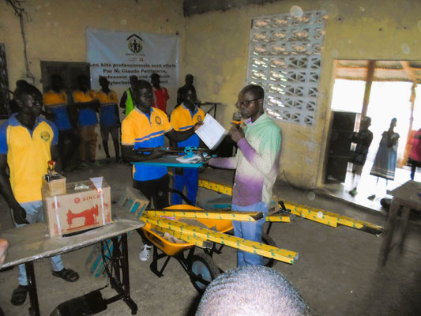
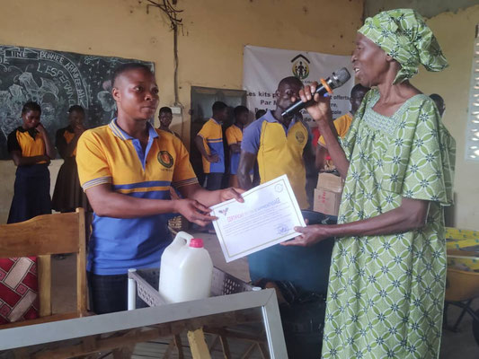
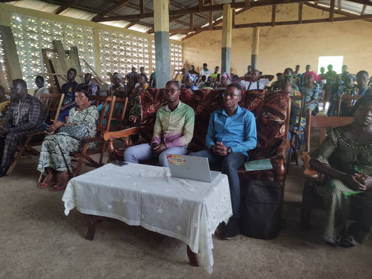
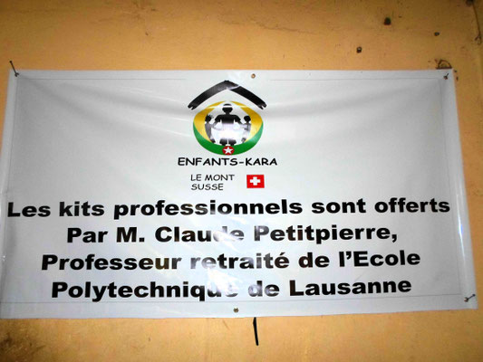
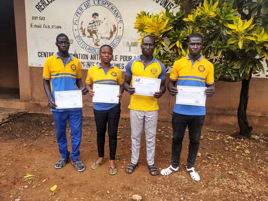
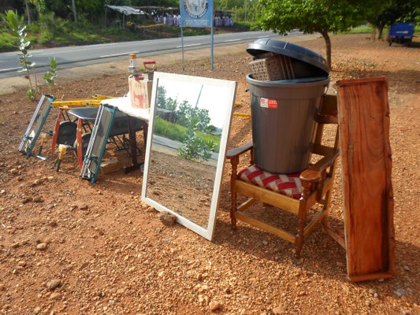

Toujours célébrée après 9 ans, la remise des diplômes a eu lieu le 11 mai 2024 au Foyer de l'Espérance, en présence des représentants locaux et de membres du comité d'Enfants-Kara.

- 
- 
- 
- 
- 
- 

Sur la photo de droite, ce n'est pas un tableau mais un miroir qui a été remis à la diplômée en Coiffure. Deux kits ont été remis à deux Carreleurs et un kit à un Couturier.
