Réunis en Assemblée Générale annuelle le 26 janvier, les membres présents de l'Association Enfants-Kara ont accepté un financement de 9'224'000 CFA (env. 15'000 CHF) pour la construction d'ateliers pour la mécanique dont la description suit.

L'aspect de la contribution à la durabilité du Foyer et de son Centre de formation a séduit les votants. En effet, on peut s'attendre à un apport financier bienvenu par la facturation des prestations effectuées.

L'exécution de la construction sera supervisée depuis la Suisse par M. P.A. Steffen, membre du comité, avec l'aide du représentant local d'EK, M. K. Bini.

***DESCRIPTION DU PROJET (document original)***

Pourquoi cet atelier au Foyer de l’Espérance de Tigbada?

Le Foyer de l’Espérance de Tigbada est en bordure de la Nationale N° 1 ; lorsque les véhicules gros porteurs sont en pannes, le point de repère pour s’immobiliser est le Foyer de l’espérance de Tigbada afin d’aller en ville pour trouver les artisans qui peuvent intervenir. Concernant les motos qui sont en panne ou ont crevé dans les environs de Tidgada, les utilisateurs de ces engins sont obligés de les traîner jusqu’à Tchébébé.

C’est dans cette justification qu'à été sollicité le poste à soudure (diesel) qui permettra de souder les parties endommagées des véhicules.

L'inauguration a eu lieu en juillet 2017 en présence de Mme la présidente Rose Balmer, du représentant d'EK au Togo M. K. Bini et des hautes autorités locales.

- 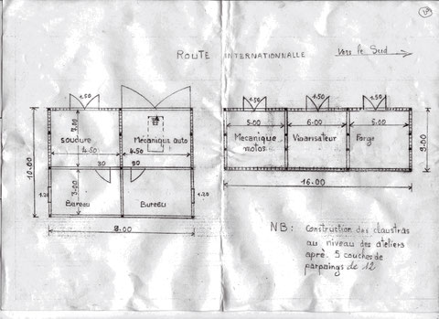
- 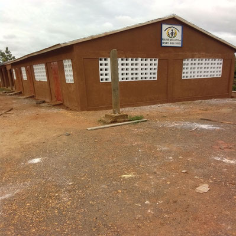
- 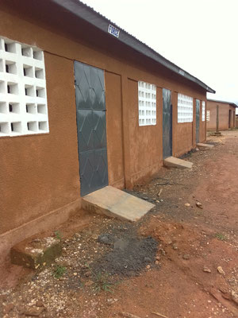
- 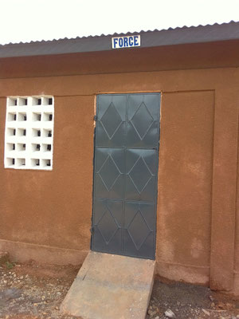
- 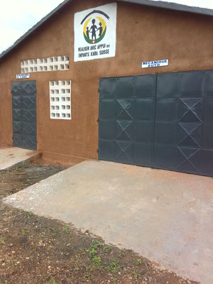
- 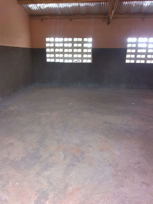
- 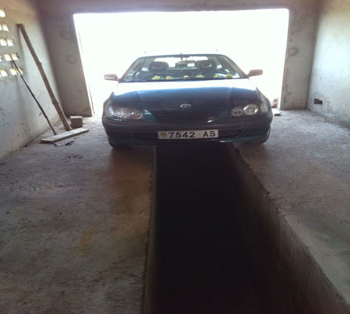
- 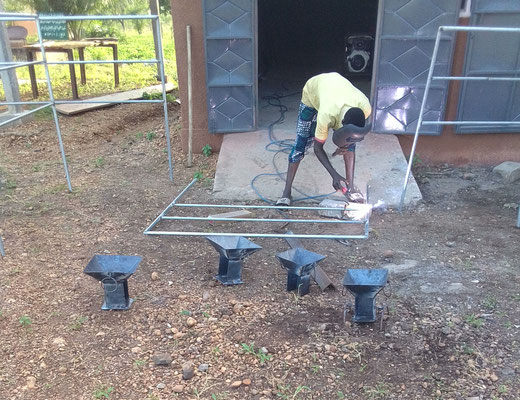
- 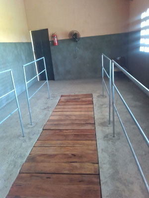
- 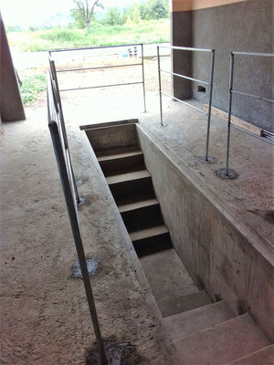
- 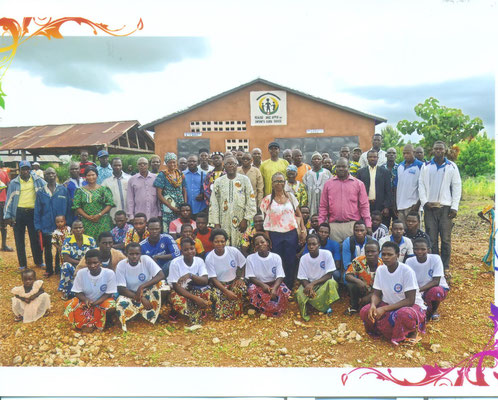
- 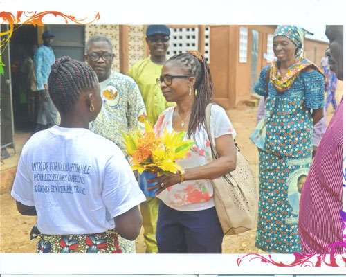
- 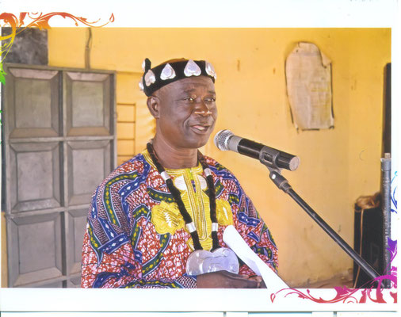
- 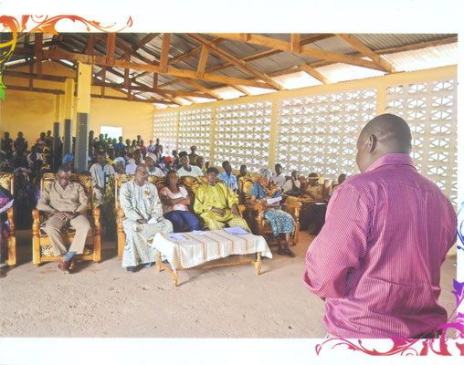
- 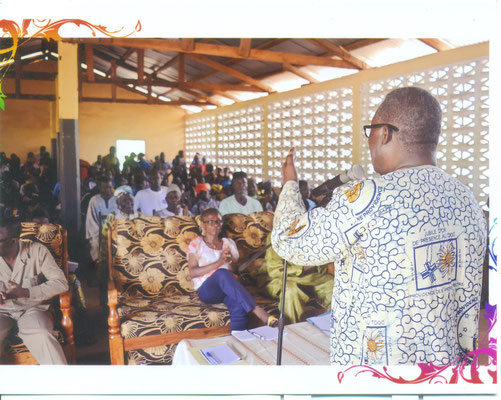
- 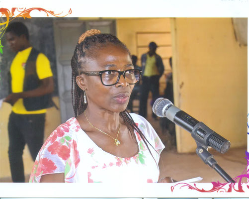
- 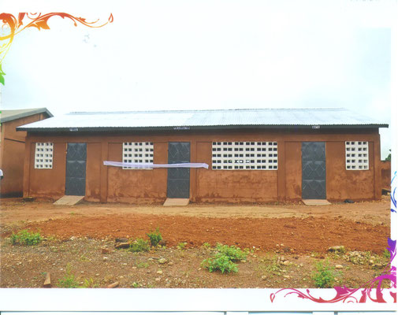
- 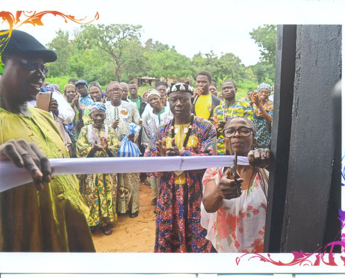
