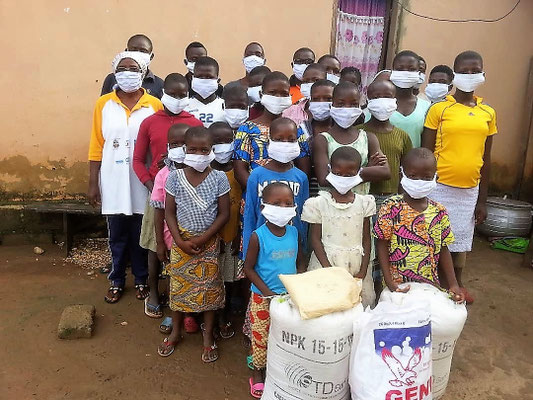
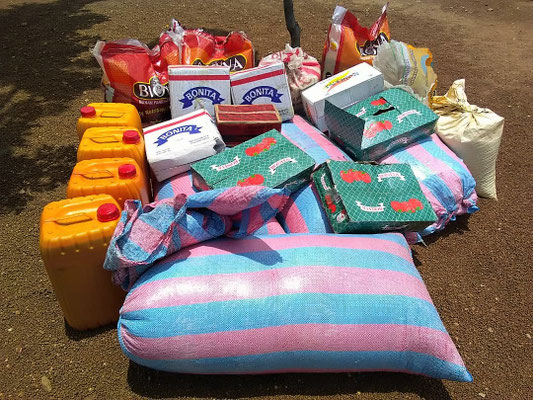
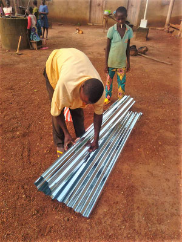
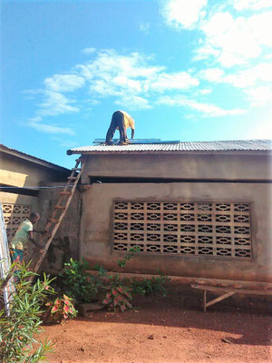
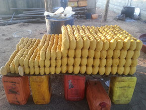

Consciente que l’aide aux autres organisations qu’elle soutient a permis à celles-ci d’atteindre une situation stable , l’association Enfants-Kara Suisse s’est approchée du Foyer Caredo. Celui-ci héberge une quarantaine d’enfants orphelins ou défavorisés. Il est géré par Mme Koffi Assomtiba Gnanta depuis plusieurs années avec de petits moyens. Dès 2019, EK CH fournit une aide pour améliorer les conditions de vie des enfants, notamment pour l’habillement et la nourriture. Plus concrètement, le versement d’une somme mensuelle de 300'000 CFA (env. 500 CHF) allégera les soucis de fonctionnement du Foyer.

- 
- 

L'argent versé contribue également à l'entretien des bâtiments d'habitation. Entre autre, des tôles du toit, percées, ont pu être remplacées.

- 
- 

Pour les enfants, l’achat de matériel destiné à la formation de la fabrication de savon et ses dérivés permettra d’initier les enfants à la production et à la vente.

Début 2021, des adultes ont été instruits et vont pouvoir initier les enfants à ce travail.

EK Togo a conclu début 2021 l’achat d’un terrain que les enfants vont pouvoir exploiter pour la culture de leur propre alimentation (céréales, légumes divers).

Un triporteur sera acheté début 2022 pour faciliter les déplacements et transports de et vers les cultures.
