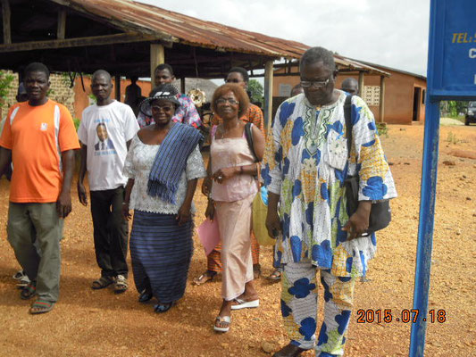
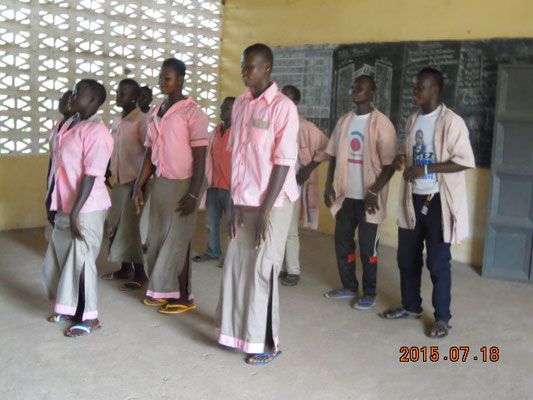
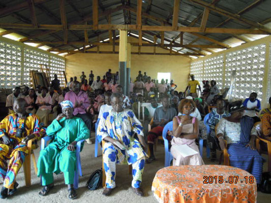
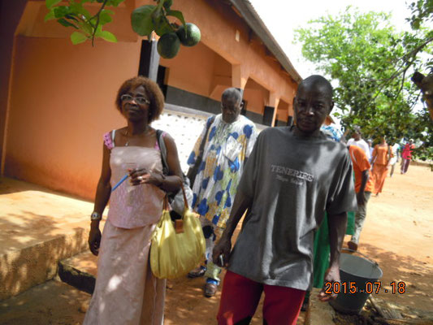
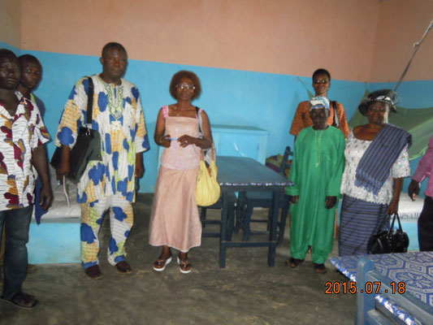
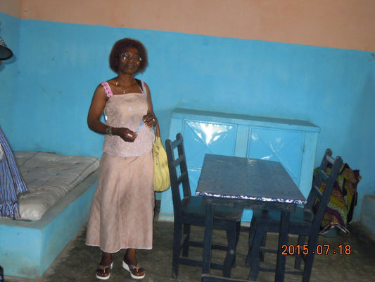
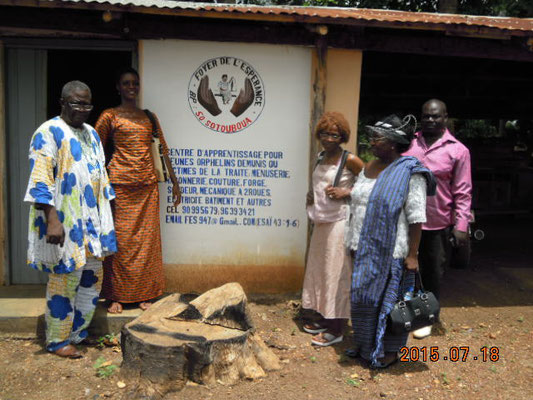
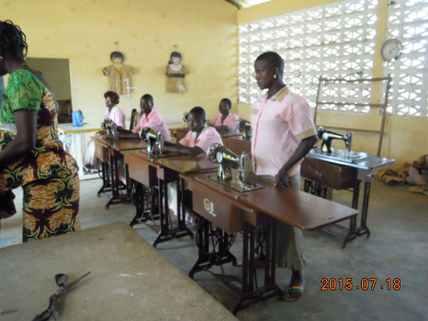
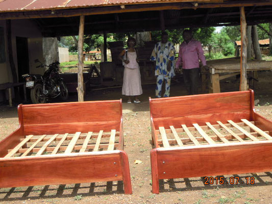

Visite de Rose Balmer, présidente de l'Association.

A l'occasion de son séjour annuel au Togo, Mme la Présidente a rendu visite au Foyer de l'Espérance et aux ateliers du Centre de Formation. Après les discours et danses de bienvenue, elle a pu visiter les dortoirs des filles, dortoirs entièrement reconstruits en 2014. La visite s'est poursuivie dans les ateliers de formation.

Joie d'accueillir la représentante des donateurs, reconnaissance envers eux pour leur soutien ont été les maîtres-mots de la journée.

Cliquez sur une image pour l'agrandir.\
Flèches gauche-droite pour changer de photo.\
Tapez Escape pour revenir au format initial.
{ .text-align-center .caption}

- 
- 
- 
- 
- 
- 
- 
- 
- 
