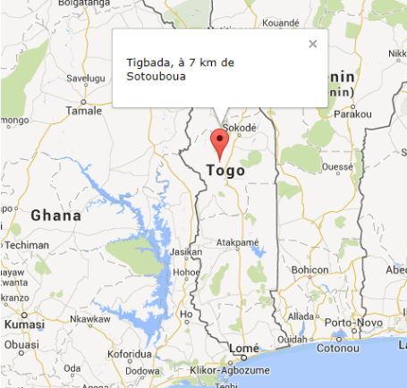
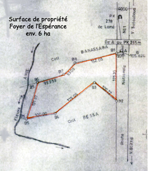
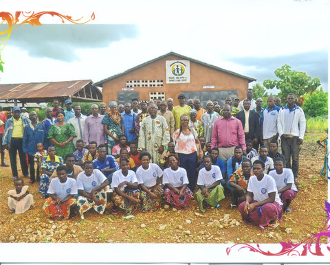

# Le Foyer de l'Espérance et son Centre de formation

En juillet 2013, grâce à un séjour dans la région de Kara, Rose et Claude Balmer ont pu identifier et visiter plusieurs établissements offrant une formation professionnelle. Après présentation de leur rapport au comité, celui-ci a choisi le Foyer de l'Espérance et son Centre de formation (FE), choix confirmé en Assemblée Générale extraordinaire. Ainsi dès 2014, l'association EK contribue au fonctionnement des structures de cette institution.

Le Foyer de l'Espérance et son Centre de formation se trouvent dans le village de Tigbada, à côté de la Nationale 1 à 120 km de Kara et à 7 km au sud de la ville de Sotouboua, canton de Tchébébé.

- 
- 
- 
