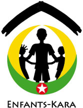

# Statuts de l'association Enfants-Kara

**Article 1 Buts, siège**

L'association ENFANTS-KARA est une association de bienfaisance sans buts lucratifs servant à soutenir la formation et des projets durables pour des enfants et des jeunes au Togo, en partant de la région de Kara.

Son siège se trouve au Mont-sur-Lausanne, auprès de Madame et Monsieur Rose et Claude BALMER, fondateurs.

**Article 2 Organisation du comité**

Le comité de l'association ENFANTS-KARA est formé par trois membres de l'association au minimum. Le comité peut comporter jusqu'à neuf membres au maximum. Les membres du comité sont élus par l'assemblée générale des membres de l'association. Ce comité sera formé au minimum des personnes suivantes:

- un président, élu par l'assemblée générale pour une durée de quatre ans, renouvelable.
- un secrétaire, élu par l'assemblée générale pour une durée de quatre ans, renouvelable.
- un trésorier, élu par l'assemblée générale pour une durée de quatre ans, renouvelable.

D'autres membres, six au maximum, s'occupant de tâches spécifiques, définies par l'assemblée générale.

Le comité informe régulièrement les membres des activités de l'association.

**Article 3 Assemblée générale**

Une assemblée générale se tient au moins une fois par année, et plus si des conditions exceptionnelles se présentent. Elle réunit les membres de l'association ENFANTS-KARA.

Ses principales tâches sont:

- élection des membres du comité
- modification des statuts
- acceptation des comptes
- faire toutes les propositions qu’elle jugera opportune
- fixer le montant des cotisations
- fixer les sommes à octroyer aux différents projets
- élire une personne en tant que vérificateur des comptes

L'assemblée générale peut élire de un à six membres supplémentaires, pour une durée de 4 ans renouvelable. Les membres du comité sont affectés à des tâches spécifiques, définies par l'assemblée générale.

Le président, le secrétaire, le trésorier et les éventuels membres supplémentaires sont élus à la majorité simple des membres présents.

Le comité fixe la date de l'assemblée générale et se charge de convoquer les membres de l'association au moins trois semaines à l'avance. Le comité fixe l'ordre du jour. Les membres de l'association peuvent ajouter de nouveaux points à l'ordre du jour.

Ces statuts remplacent les statuts du 31 octobre 2001 et prennent effet au 29 mars 2012.

Suivent les signatures des membres fondateurs :

Rose Balmer Denis Poisat Claude Balmer

Le Mont, le 29 mars 2012
