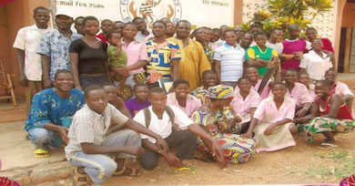

# Devenir membre

Si vous le souhaitez, vous pouvez devenir membre.

Votre cotisation nous permettra de compter sur un apport financier fixe. Il nous permettra d'assurer la continuité de notre action.

Notre cotisation annuelle n'est pas rigidement fixée, mais nos membres actuels versent des montants annuels de l'ordre de Frs. 120.--. Bien entendu, chacun peut verser ce qu'il veut ou peut en fonction de ses moyens et de l'entraide qu'il souhaite apporter.

Merci d'avance quel que soit votre choix !

Merci de faire le versement selon les coordonnées bancaires suivantes, en mentionnant "Cotisation 20XX" :

    IBAN: CH23 0900 0000 1754 5294 4 La Poste, Suisse

    CCP: 17-545294-4 La Poste suisse
    Enfants-Kara
    CH-1264 St-Cergue
    Suisse

Vous pouvez aussi nous demander l'envoi à votre adresse postale d'un bulletin de versement en utilisant le message électronique qui suit :

**Merci de votre intérêt pour eux !**

