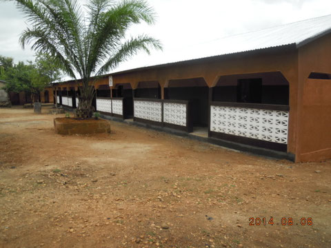
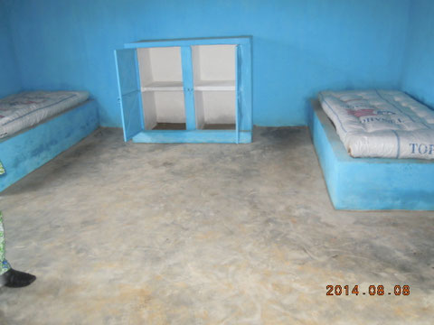
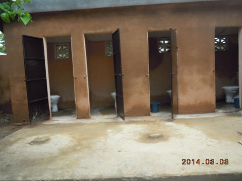
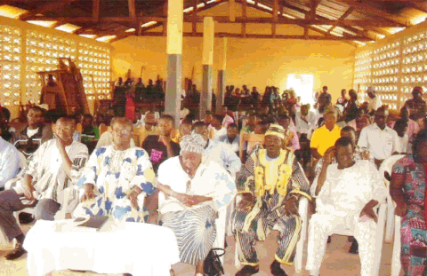

# Foyer de l'Espérance 2014

Conformément à la décision des membres d'EK réunis lors de leur Assemblée Générale Extraordinaire du 27 novembre 2013, la construction de dortoirs, latrines et douches pour un montant de CHF 20'000.-, selon devis, a été initialisée en mars 2014.

 Constructions achevées en août 2014:

- Bâtiment "dortoir filles" comportant 10 chambres à 2 places
- 4 "douches filles"
- 4 "latrines filles"
- 2 "douches garçons"
- 2 "latrines garçons"

La progression des travaux a été suivi par M. Kilim BINI, précédemment notre représentant au foyer Ste Marguerite. Il nous en a fait le rapport d'avancement toutes les 2 semaines. Une inauguration solennelle a eu lieu en août 2014 en présence de notables locaux.

Les nouveaux dortoirs (10 chambres doubles)

Une des chambres aménagée

4 Latrines "filles"

Douches et latrines "Garçons" sont à l'identique.

Inauguration
