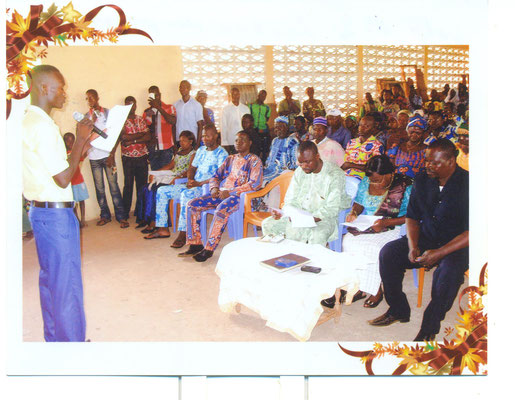
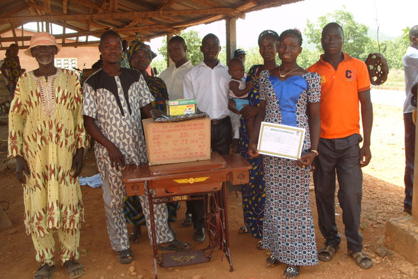
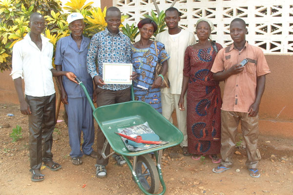

# Diplômés 2015

Les kits ont été remis pour la première fois lors de la remise des diplômes de fin de formation au printemps 2015. Ils ont été accueillis avec joie et l'association a été chaleureusement remerciée pour cette initiative.

La répartition entre les différents métiers se présente ainsi :

Couture 9 diplômes

Maçonnerie 3 diplômes

Ferronnerie 2 diplômes

Electricité bâtiment 1 diplôme

- 
- 
- 
- 
